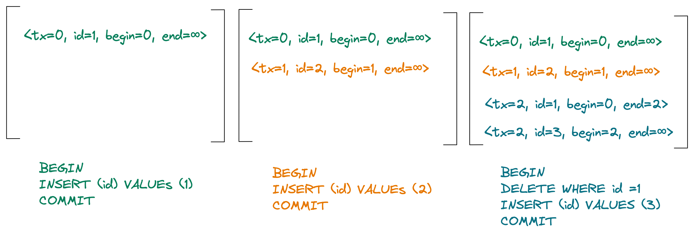

# Design

## Persistent storage

Persistent storage must implement the `Storage` trait that the MVCC module uses to essentially store a write-ahead log (WAL) of mutations.

Figure 1 shows an example of write-ahead log across three transactions.
The first transaction T0 executes a `INSERT (id) VALUES (1)` statement, which results in a mutation with `id` set to `1`, begin timestamp to 0 (which is the transaction ID) and end timestamp as infinity (meaning the row version is still visible).
The second transaction T1 executes another `INSERT` statement, which adds another mutation to the WAL with `id` set to `2`, begin timesstamp to 1 and end timestamp as infinity, similar to what T0 did.
Finally, a third transaction T2 executes two statements: `DELETE WHERE id = 1` and `INSERT (id) VALUES (3)`. The first one results in a mutation with `id` set to `1` and begin timestamp set to 0 (which is the transaction that created the entry). However, the end timestamp is now set to 2 (the current transaction), which means the entry is now deleted.
The second statement results in an entry in the WAL similar to the `INSERT` statements in T0 and T1.

Figure 1. Write-ahead log of mutations across three transactions.

When MVCC bootstraps or recovers, it simply reads the write-ahead log into the in-memory index, and it's good to go.
If the WAL grows big, we can compact it by dropping all entries that are no longer visible after the the latest transaction.
